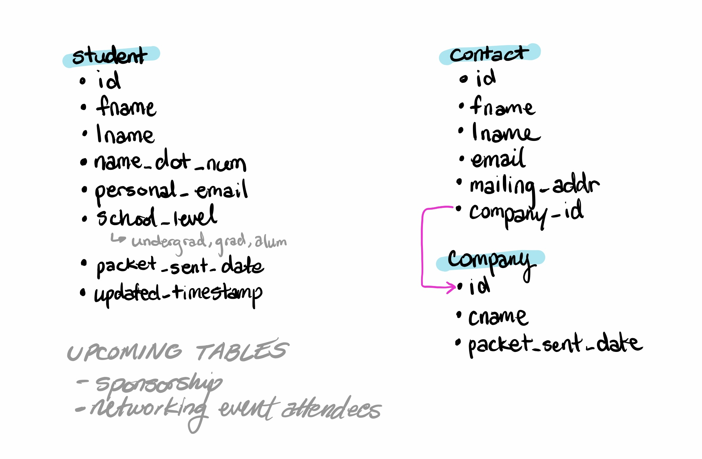

# acmwosu-db
Interface for ACM-W Exec Board members to query database of contacts and members.

Using PostgreSQL v11.8

## Installation for local development
1. Clone the repository
2. [Install Node.js and npm](https://docs.npmjs.com/downloading-and-installing-node-js-and-npm) if not already installed
3. Run ```npm install``` from the acmwosu-db directory

## Running database migrations
You will need an .env file with the relevant DB connection info.
From the acmwosu-db directory, run the command ```npm run migrate```.

## Database design

